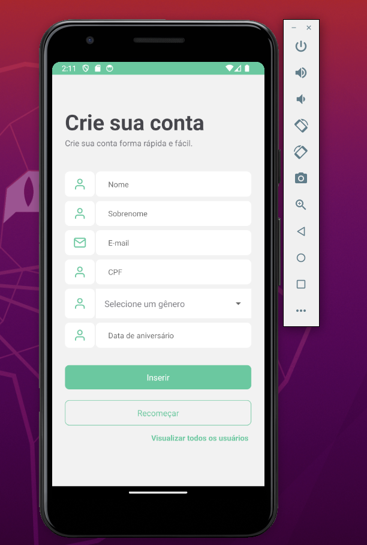
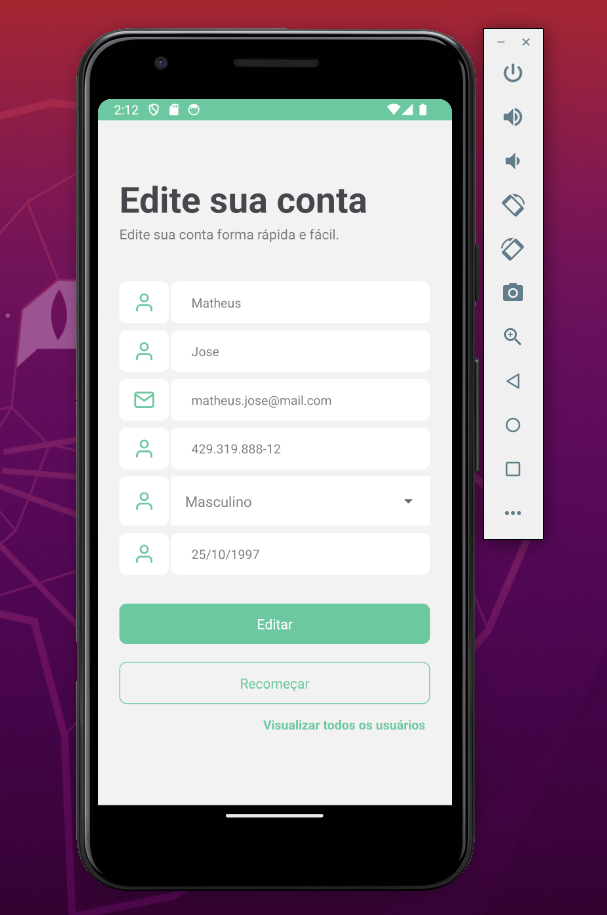
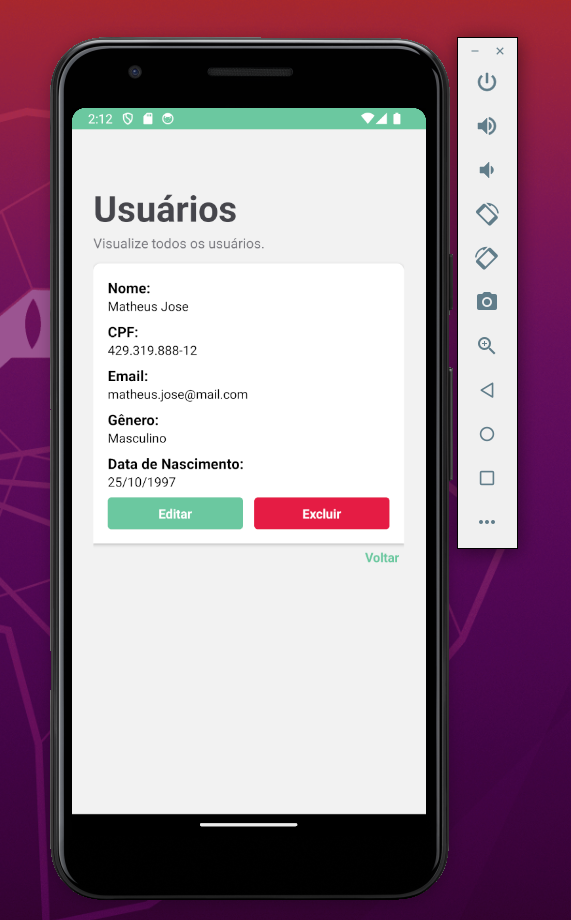
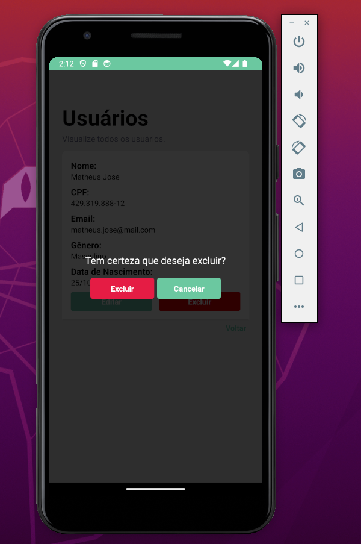

### Introdução:
Este projeto foi desenvolvido como parte do processo de candidatura para a vaga de desenvolvedor.
O objetivo do projeto, que é criar uma interface para realizar operações CRUD (Criar, Ler, Atualizar, Deletar)
em registros de usuários.

### Tecnologias Utilizadas:
- **Expo:** Expo foi selecionado para acelerar o processo de desenvolvimento, tornando-o mais acessível e eficiente,
especialmente para desenvolvedores que estão começando no mundo do desenvolvimento mobile.
- **React Native:** Nginx foi selecionado para o desenvolvimento do aplicativo.

### Funcionalidades:





### Aprendizados:
- React Hook Form e Context Api.

### Conclusão:
Tenho alguma exposição a React Native através de estudos e projetos pessoais, mas não tenho uma ampla experiência 
prática com a tecnologia em um ambiente de trabalho. No entanto, estou entusiasmado em aprender
e crescer na área de desenvolvimento mobile.
Minhas experiências anteriores sem concetram em desenvolvimento backend com PHP e Vue.js, mas, estou confiante de que 
posso rapidamente me adaptar ao ambiente de desenvolvimento mobile.
Este projeto é um reflexo do meu comprometimento..

### Como utilizar:
Para iniciar os serviços, clone o projeto e abra um terminal na raiz e execute o seguinte comando:

```
npm start ou expo start
```

### Observação:
- Este repositório é apenas a parte do aplicativo, para realizar a integração com o backend, segue as instruções desse [repositório](https://github.com/matheussouzajose/iP4y):
- Todas as operações do CRUD está integrado com o backend, para realizar os testes será necessário ter todos os ambientes rodando.
